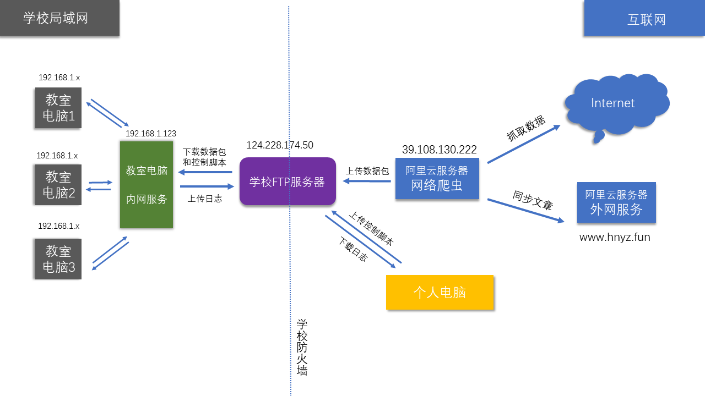
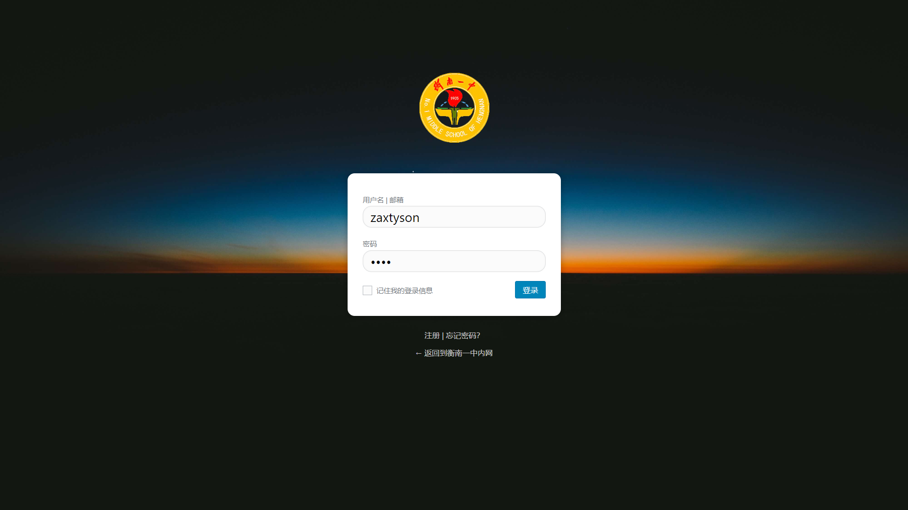
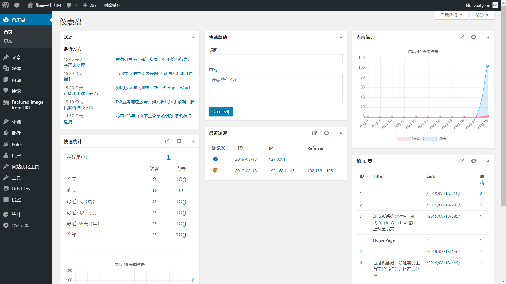

# 衡南一中内网计划

## 简介
这是一个利用学校FTP为中继的新闻同步程序，可以实现在无网络的环境下提供新闻、视频、天气、歌单同步服务。

## 开发背景
- 学校封闭式管理，很少能接触外界的信息  
- 语文老考新闻，英语老考科技新闻，多看点新闻总是没害处吧
- 《意林》、《读者》真的越来越水，居然还涨价了(穷啊)... 
- 高三压力有点大，写写代码分散注意力，放松一下
- 我也不知道怎么的就开始了这个计划(-.-)
- 虽然叫内网计划，但是包括学校内部的网站和[外网](http://www.hnyz.fun)部分

## 程序功能
- [x] 更新国内外新闻
- [x] 数据库自动清理 
- [x] 更新天气预报
- [x] 广播站歌单同步
- [x] 执行远程脚本
- [x] [外网](http://www.hnyz.fun)文章同步
- [x] 日志上传

## 数据来源
> 由于部分数据来自国外网站，可能存在政治敏感、思想误导性的内容，如果发现，请联系我，
服务器端将进行过滤  

CCTV央视新闻、英国BBC电台、路透社、FT中文网、知乎、纽约时报、半岛新闻、
维基百科、澳大利亚ABC电台、网易、ifar、cnbetatop、36kr、果壳网等等  

## 工作原理

## 界面演示
> 网站使用wordpress搭建，主题风格可以随便换

## 运营状态
> 高三上学期  

- 各种原因导致网站访问相当慢，体验极差。胆小不敢宣传，而且没时间折腾。  
- 没什么人访问，访问量相当凄惨。
> 高三下学期

- 社团负责人帮忙宣传(仅在高二校区，快毕业不敢闹事，不敢在高三宣传，高一校区隔离，不便宣传)  
- 每天30多个班访问，日点击近千次。

> 高考前不久 

- 系统被高三某电脑老师重装(为了装一个教学软件)，网站崩溃。  
- 重装回原来系统，解决教学软件兼容问题，网站继续运营。  
- 两天后，再次被重装，磁盘被格式化，数据全部丢失。
- 内网关闭，高二电脑老师表示支持设备，计划高考后上线。

> 高考后

- 高二电脑老师跑路...嘤嘤嘤...
- 外网仍在运营，访问量凄惨。

> 目前
- 寻找有技术的新生继任，完成网站建设，继续运营...
- 如果你想接手这个网站，那可真的是太感谢了！
- 请务必看看这个[简陋的教程](./build.md)
- 如果有任何问题，请直接联系我，我一定尽力解决
- [戳这个直接联系我](http://wpa.qq.com/msgrd?v=3&uin=3034557307&site=qq&menu=yes)
